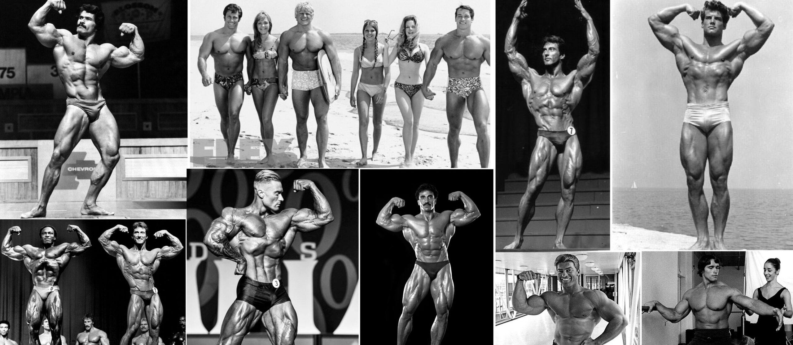

  

  
	
	

  

    <h1>COURSE PROJECT FOR 3RD YEAR</h1>
  

  <a>Course project on the subject "MDK 11.01 Technology of development and protection of databases". 
    The topic of my course project: "Design and development of a database for sports competitions".</a>
  

    <h2>Introduction to the topic.</h2>
  

  <a>The path of bodybuilding and fitness can be traced back to ancient Greece with its ancient sculptures. At all times, especially in ancient times, there has been an interest in physical strength and its effect on human health. The greatest popularity of this sport was from the late 1970s to the early 1990s. It was an era of giants who pushed the boundaries of human strength and physique to new heights, inspiring countless people to follow in their footsteps. 
Nowadays bodybuilding is one of the most popular sports. There are many regional and international competitions for men and women all over the world.</a>
  

    <h2>Problematics.</h2>
  

  <a>With the advent of information technology, bodybuilding has become known to a larger part of the population. Many people began to learn about upcoming events, follow them and learn about the results via the Internet. But there is no unified system for organizing and conducting competitions. There is also a high risk of falsification of competition results.</a>
  

    <h2>Project Objective.</h2>
  

  <a>The aim of the project is to develop a desktop application for organizing bodybuilding competitions</a>
  

    <h2>What did you end up with?</h2>
  

  <a>The result of the course project is developed and functioning desktop application for organizing bodybuilding competitions. 
The application allows to optimize the time of work of the organizer, jury member, athlete; to save them all from "paperwork" and falsification of competition results. It also gives an opportunity to familiarize with information about competitions and athletes to simple users of the system.
Also the application has a very strong bodybuilding style.</a>

